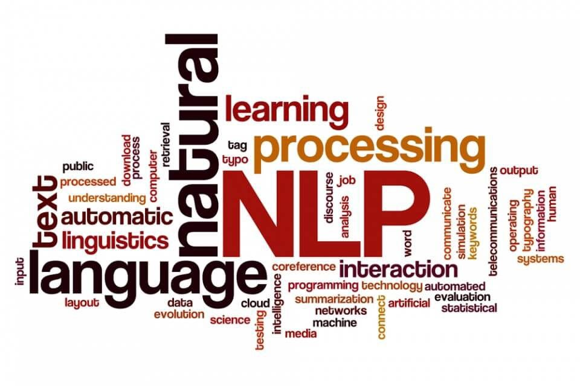

# Data Science Portfolio
Welcome to my project portfolio! Below is a showcase of some key projects I have worked on, each demonstrating my expertise in data analysis, predictive modeling, and business insights.

---

## Machine Learning Projects

### Loan Default Risk Analysis and Prediction

**Description**: Analyzed loan data to identify key risk factors leading to defaults.

**Skills**: Data Cleaning, EDA, Predictive Modeling, Risk Analysis  
**Tools Used**: [Python](https://www.python.org/), [Pandas](https://pandas.pydata.org/), [Matplotlib](https://matplotlib.org/), [Scikit-learn](https://scikit-learn.org/)  
**Outcome**: Built a robust model to predict loan defaults, enabling proactive risk management.

---

### Telecom Churn Case Study

**Description**: Developed a churn prediction model for the telecom industry, identifying drivers like price sensitivity, poor network quality, and low engagement.

**Skills**: Feature Engineering, Classification Models, Customer Retention Analysis  
**Tools Used**: [Python](https://www.python.org/), [Scikit-learn](https://scikit-learn.org/), [Matplotlib](https://matplotlib.org/), [Seaborn](https://seaborn.pydata.org/)  
**Outcome**: Provided actionable insights to reduce churn and enhance customer loyalty.

---

### Lead Scoring Case Study

**Description**: Improved X Education's lead conversion rate (from 30%) by identifying and prioritizing 'Hot Leads'.

**Skills**: Data Analysis, Logistic Regression, KPI Optimization  
**Tools Used**: [Python](https://www.python.org/), [Pandas](https://pandas.pydata.org/), [NumPy](https://numpy.org/), [Seaborn](https://seaborn.pydata.org/)  
**Outcome**: Delivered a scalable lead scoring model, increasing efficiency in lead management.

---

### Bike Sharing Assignment

**Description**: Developed a demand forecasting model to understand the dynamics of bike rentals in a new market.

**Skills**: Time Series Analysis, Demand Prediction, Regression Modeling  
**Tools Used**: [Python](https://www.python.org/), [Statsmodels](https://www.statsmodels.org/), [Matplotlib](https://matplotlib.org/)  
**Outcome**: Helped management with data-driven insights to support business expansion.

---

### RSVP Movies Analysis

**Description**: Conducted an in-depth analysis of RSVP Movies data using SQL queries to extract actionable insights.

**Skills**: SQL Querying, Data Analysis, Relational Databases  
**Tools Used**: [MySQL](https://www.mysql.com/), [Tableau](https://www.tableau.com/)  
**Outcome**: Provided data-backed recommendations for optimizing movie performance and audience targeting.

---

**Key Skills and Technical Expertise**

**Key Skills**

NLP Insights, Text Preprocessing, Language Modeling, Topic Modeling, Text Summarization, Machine Translation

**Technical Skills**

Languages/Tools: Python, SQL, OpenAI API, Flask, Pandas, NumPy, Keras, XGBoost

Cloud Platforms: AWS, GCP

Databases: MongoDB, MySQL, PostgreSQL, SQLite

Libraries/Frameworks: NLTK, TensorFlow, PyTorch, Scikit-learn, Google Natural Language API

**Certifications**

Post Graduate Diploma in Data Science, IIIT Bangalore & upGrad(Continue)

Python Bootcamp, Udemy
---
---

**Resume**
---
---

**Data Analytics:**

Advanced insights into large-scale data processing, visualization, and analytics solutions.
[Download the PDF](https://github.com/Abhra-deep/minimal/blob/master/assets/img/Data%20Analyst%20resume.pdf)

**Data Science:**

In-depth expertise in extracting actionable insights from large datasets, applying advanced machine learning algorithms, and building predictive models. Skilled in data preprocessing, feature engineering, and developing scalable analytics solutions to solve complex business problems.[Download the PDF](https://github.com/Abhra-deep/Portfolio/tree/master/assets)

---
---

**NLP:**

Expertise in text processing, semantic analysis, and language modeling to deliver actionable results.
[Download the PDF](https://github.com/Abhra-deep/minimal/blob/master/assets/img/NLP%20Resume.pdf))
---
---

**Ai & ML:**

Skilled in deploying machine learning and artificial intelligence solutions for predictive analytics.
[Download the PDF](https://github.com/Abhra-deep/minimal/blob/master/assets/img/Ai%20%26%20ML.pdf)

---
---

**Python:**

Extensive experience in Python for machine learning, automation, and software development.
[Download the PDF](https://github.com/Abhra-deep/minimal/blob/master/assets/img/Python.pdf)

---
---

**Get in Touch**
Feel free to reach out if you’d like to discuss any of these projects or if you are interested in collaborating on new ones. You can contact me through [LinkedIn](www.linkedin.com/in/abhradeepchandrapaul) or via email at (abhradeepchandrapaul@gmail.com).

**Closing Statement**

Thank You for Visiting

Thank you for taking the time to explore my portfolio. I am passionate about solving complex data problems and creating actionable insights to drive business success. Let's collaborate to make data-driven decisions that create meaningful impact.

**Call-to-Action**

Let’s Collaborate,
If you’re looking for a dedicated and skilled professional for your next data project, don’t hesitate to get in touch. Together, we can build innovative solutions and unlock the true potential of data.

